# MFI DDB Library

Library to stream data to Digital Data Backend (DDB) for the MFI project.


## Installation

### using uv manager

Pre-requisite: Install [uv manager](https://docs.astral.sh/uv/getting-started/installation/)

```
git clone --recurse-submodules https://github.com/cmu-mfi/mfi_ddb_library.git
cd mfi_ddb_library
uv sync
```

### using pip/venv

**Linux**
```
git clone --recurse-submodules https://github.com/cmu-mfi/mfi_ddb_library.git
cd mfi_ddb_library
python -m venv .venv
source .venv/bin/activate
pip install .
```

**Windows CMD**
```
git clone --recurse-submodules https://github.com/cmu-mfi/mfi_ddb_library.git
cd mfi_ddb_library
python -m venv .venv
.venv\Scripts\activate.bat
pip install .
```

## Concept

```mermaid
flowchart LR;
    A[Data Source] --> B[Data Adapter];
    D[Streamer] --> M[MQTT Client];
    B --> D;
    C[Topic Family] --> D;
    M-->X[MQTT Broker];    

    classDef highlight fill:#094d57
    class B,C,D highlight
```



MFI DDB Library gives tools to write
* "MQTT Client" which streams data from a "Data Source" to a "MQTT broker". The data source may not be generating MQTT messages directly as per [MFI-DDB schema](./schema/README.md). The library provides a way to convert the data to MQTT messages and stream them to the broker.

To be able to do the above three major classes are provided:

* **Data Adapter**: These are the objects that represent the data that needs to be streamed. These objects are responsible for converting the data to mfi_ddb ingestible structure.
* **Streamer**: This is responsible for publishing MQTT messages to the broker. It uses the data from data adapters to stream the data. Streaming can be event driven using obeserver callback or polling based.
* **Topic Family**: These classes allow streamer to convert data from adapters to MQTT payload as required by respective topic branch (`historian`, `blob`, `kv`)

## Usage

* Review the [examples](examples) for usage.

* **[WIP]** [mqtt_client_tutorial.ipynb](examples/mqtt_client_tutorial.ipynb) gives a step by step tutorial to write your own MQTT client for mfi_ddb franework.

## Available Classes

### Data Adapters

* [BaseDataAdapter](mfi_ddb/data_adapters/base.py)
* [RosDataAdapter](mfi_ddb/data_adapters/mtconnect.py)
* [RosFilesDataAdapter](mfi_ddb/data_adapters/ros_files.py)
* [LocalFilesDataAdapter](mfi_ddb/data_adapters/local_files.py)
* [MqttDataAdapter](mfi_ddb/data_adapters/mqtt.py)
* [MTconnectDataAdapter](mfi_ddb/data_adapters/mtconnect.py)

### Streamer

* [Streamer](mfi_ddb/streamer/streamer.py)

### Topic Family

* [BaseTopicFamily](mfi_ddb/topic_families/base.py)
* [BlobTopicFamily](mfi_ddb/topic_families/blob.py)
* [KeyValueTopicFamily](mfi_ddb/topic_families/key_value.py)
* [SpbTopicFamily](mfi_ddb/topic_families/time_series_spb.py)

## Streaming Metadata

When streaming data to the broker, the following metadata is recorded through the `mfi-ddb` stream:

| Metadata | Description | Recorded as |
|-------|-------------|-------------|
| location context | The location context of the data being streamed, which includes the enterprise, site, area, and device. | [topic structure](./schema/README.md) |
| attributes | Key-value pairs that provide additional information about the data being streamed. These are defined in the adapter yaml configuration file. | streamed on the same topic before data using the same topic family encoding |
| streaming configuration | The configuration of the data stream, which includes broker information, enterprise and site details. | streamed on the `kv` and `blob` at birth and death of data streaming  |
| adapter configuration | The configuration of the adapter that is streaming the data, which includes all the components and their attributes | streamed on the `kv` and `blob` at birth and death of data streaming |  

## Executable Modules

### [store_cfs.py](mfi_ddb/scripts/store_cfs.py)

```
usage: store_cfs.py [-h] mqtt_config_path cfs_config_path

Subscribe to a topic and save files to Cloud File Store (CFS) based on configuration.

positional arguments:
  mqtt_config_path  Path to the MQTT configuration file (e.g., mqtt.yaml).
  cfs_config_path   Path to the CFS configuration file (e.g., cfs.yaml).
```

```
# Example usage:

python -m mfi_ddb.scripts.store_cfs path/to/mqtt.yaml path/to/cfs.yaml
```

### [stream_adapter.py](mfi_ddb/scripts/stream_adapter.py)

```
usage: stream_adapter.py [-h] --data_adapter DATA_ADAPTER [--config_dir CONFIG_DIR]
                         [--adapter_cfg ADAPTER_CFG] [--mqtt_cfg MQTT_CFG] [--polling POLLING]
                         [--poll_rate POLL_RATE]

Stream data using MFI-DDB library.

optional arguments:
  -h, --help            show this help message and exit
  --data_adapter DATA_ADAPTER, -d DATA_ADAPTER
                        Type of data adapter to use. Supported: 'Local Files', 'MTConnect', 'MQTT',
                        'ROS', 'ROS Files'
  --config_dir CONFIG_DIR, -cd CONFIG_DIR
                        (optional) Directory containing the configuration files (localfiles.yaml and
                        mqtt.yaml). If --mqtt_cfg or --adapter_cfg are provided, this argument is
                        ignored.
  --adapter_cfg ADAPTER_CFG, -a ADAPTER_CFG
                        (optional) Path to the local files adapter configuration file
                        (localfiles.yaml).
  --mqtt_cfg MQTT_CFG, -m MQTT_CFG
                        (optional) Path to the MQTT configuration file (mqtt.yaml).
  --polling POLLING, -p POLLING
                        Enable polling mode. Default is False.
  --poll_rate POLL_RATE, -r POLL_RATE
                        Polling rate in Hz. Default is 1 Hz, if --polling is set to True.
```

```
Example usage:

Use a configuration directory:
$ python -m mfi_ddb.scripts.stream_adapter --data_adapter 'MQTT' --config_dir ./configs

Use specific configuration files:
$ python -m mfi_ddb.scripts.stream_adapter -d 'Local Files' --adapter_cfg ./configs/localfiles.yaml --mqtt_cfg ./configs/mqtt.yaml

Enable polling mode with a specific rate (in Hz):
$ python -m mfi_ddb.scripts.stream_adapter -d 'MTConnect' -a ./configs/mtconnect.yaml -m ./configs/mqtt.yaml -p True -r 2
```