# MFI DDB Library

Library to stream data to Digital Data Backend (DDB) for the MFI project.


## Installation

```
pip install mfi_ddb @ git+https://github.com/cmu-mfi/mfi_ddb_library.git
```

## Concept

```mermaid
flowchart LR;
    A[Data Source]-->B[MQTT Client]-->C[MQTT Broker]

    classDef highlight fill:#094d57
    class B highlight
```



MFI DDB Library gives tools to write the "MQTT Client" which streams data from a "Data Source" to a "MQTT broker". The data source may not be generating MQTT messages directly. The library provides a way to convert the data to MQTT messages and stream them to the broker.

To be able to do the above two types of classes are provided:

* **Data Objects**: These are the objects that represent the data that needs to be streamed. These objects are responsible for converting the data to MQTT messages.
* **Streaming Objects**: These are the objects that are responsible for publishing MQTT messages to the broker. They use the data from data objects to stream the data. Streaming can be event driven (push) or time driven (pull).

## Available Classes

### Data Objects

* [BaseDataObject](mfi_ddb/data_objects/base_data_object.py): Base class for all data objects.
* [MTConnectDataObject](mfi_ddb/data_objects/mtconnect.py): Data object for MTConnect data.
* [RosDataObject](mfi_ddb/data_objects/ros1.py): Data object for ROS data.

### Streaming Objects

* [PushStreamToMqttSpb](mfi_ddb/push_stream_to_mqtt_spb.py): Push streaming to MQTT broker using sparkplug_b protocol.
* [PullStreamToMqttSpb](mfi_ddb/pull_stream_to_mqtt_spb.py): Pull streaming to MQTT broker using sparkplug_b protocol.

## Usage

Review the [examples](examples) for usage.