# MFI DDB Library

Library to stream data to Digital Data Backend (DDB) for the MFI project.


## Installation

```
pip install mfi_ddb @ git+https://github.com/cmu-mfi/mfi_ddb_library.git
```

## Concept

```mermaid
flowchart LR;
    A[Data Source]-->B[MQTT Client]-->C[MQTT Broker]-->D[MQTT Subscriber]-->E[Data Sink]

    classDef highlight fill:#094d57
    class B,D highlight
```



MFI DDB Library gives tools to write
* "MQTT Client" which streams data from a "Data Source" to a "MQTT broker". The data source may not be generating MQTT messages directly. The library provides a way to convert the data to MQTT messages and stream them to the broker.
* "MQTT Subscriber" which subscribes to the MQTT broker and receives the data. The data can be stored in a database or used for other purposes.

To be able to do the above two types of classes are provided:

* **Data Objects**: These are the objects that represent the data that needs to be streamed. These objects are responsible for converting the data to MQTT messages.
* **Streaming Objects**: These are the objects that are responsible for publishing MQTT messages to the broker. They use the data from data objects to stream the data. Streaming can be event driven (push) or time driven (pull).
* **MQTT Subscriber**: This is the object that subscribes to the MQTT broker and receives the data.
* **Message Handlers**: These are the objects that handle the messages received by the MQTT subscriber. They can store the data in a database or perform other operations.

## Available Classes

### Data Objects

* [BaseDataObject](mfi_ddb/data_objects/base_data_object.py): Base class for all data objects.
* [MTConnectDataObject](mfi_ddb/data_objects/mtconnect.py): Data object for MTConnect data.
* [RosDataObject](mfi_ddb/data_objects/ros1.py): Data object for ROS data.

### Streaming Objects

* [PushStreamToMqttSpb](mfi_ddb/push_stream_to_mqtt_spb.py): Push streaming to MQTT broker using sparkplug_b protocol.
* [PullStreamToMqttSpb](mfi_ddb/pull_stream_to_mqtt_spb.py): Pull streaming to MQTT broker using sparkplug_b protocol.
* [PushStreamToMqtt](mfi_ddb/push_stream_to_mqtt.py): Push streaming to MQTT broker. Data is sent as [pickle](https://docs.python.org/3/library/pickle.html) serialized dictionary.
* [PullStreamToMqtt](mfi_ddb/pull_stream_to_mqtt.py): Pull streaming to MQTT broker. Data is sent as [pickle](https://docs.python.org/3/library/pickle.html) serialized dictionary.

### Message Subscriber

* [MqttSubscriber](mfi_ddb/mqtt_subscriber.py): MQTT subscriber to receive messages from the broker.

### Message Handlers

These are not classes, but functions that are be used to handle the messages received by the MQTT subscriber.

* [lfs_handler](mfi_ddb/msg_handlers/lfs_handler.py): Handler to store the data in a local file system.


## Usage

Review the [examples](examples) for usage.