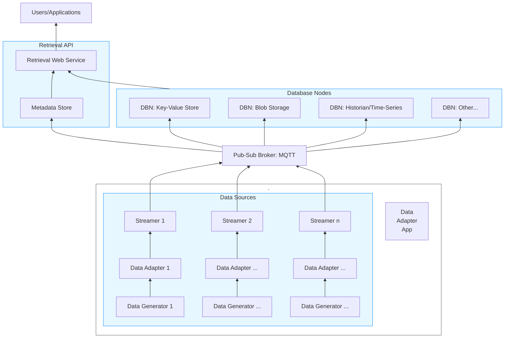

# MFI Digital Data Backbone (DDB) Library

A comprehensive Python-based framework for streaming data from various sources to the MFI Digital Data Backbone. This library provides tools for data ingestion, metadata storage, and retrieval services.

The MFI DDB Library serves as a unified data pipeline, enabling seamless ingestion of real-time data from diverse sources—including IoT sensors, file systems, and MQTT brokers—into a central pub-sub messaging system. This architecture decouples data producers from consumers, allowing multiple downstream databases to subscribe to the broker and store data without direct integration with source systems. Data is then available through simple API calls.

---

## Architecture

_Arrow direction in the diagram below shows the data flow in the framework. It doesn't represent the direction of requests._


```mermaid
flowchart BT
    subgraph Input["."]
        direction LR

        DAA[Data</br>Adapter</br>App</br>]

        subgraph Data_Sources["Data Sources"]
            direction LR
            DS1[Data Generator 1] --> DA1[Data Adapter 1]
            DA1 --> S1[Streamer 1]
            DS2[Data Generator ...] --> DA2[Data Adapter ...]
            DA2 --> S2[Streamer 2]
            DSn[Data Generator ...] --> DAn[Data Adapter ...]
            DAn --> Sn[Streamer n]
        end
    end

    MQTT[Pub-Sub Broker: MQTT]

    subgraph DBN["Database Nodes"]
        direction LR
        KV[DBN: Key-Value Store]
        BLOB[DBN: Blob Storage]
        HISTORIAN[DBN: Historian/Time-Series]
        DBNx[DBN: Other...]
    end

    subgraph Retrieval["Retrieval API"]
        direction TB
        MDS[Metadata Store] --> RWS[Retrieval Web Service]
    end

    S1 --> MQTT
    S2 --> MQTT
    Sn --> MQTT
    MQTT --> KV
    MQTT --> BLOB
    MQTT --> HISTORIAN
    MQTT --> DBNx
    MQTT --> MDS
    DBN --> RWS
    RWS --> USERS[Users/Applications]

    classDef layer fill:#e6f7ff,stroke:#1890ff
    classDef highlight fill:#094d57,stroke:#0a3d4d
    class Data_Sources,DBN,Retrieval layer
    style Input fill:transparent,stroke:#666
```

---

## Components

### 1. Core Library (`mfi_ddb_package`)
The core Python package providing the foundational classes for data streaming:
- **Data Adapters**: Convert data from various sources to MFI-DDB format
- **Streamers**: Publish MQTT messages to the broker
- **Topic Families**: Format data for different topic branches (historian, blob, kv)

The core package also defines the payload schema for each topic family streaming. [schema details](./mfi_ddb_package/src/mfi_ddb/topic_families/schema/)

The core package can be installed using pip. [https://pypi.org/project/mfi-ddb/](https://pypi.org/project/mfi-ddb/1.1.0/)

### 2. Data Adapter App (`mfi_ddb_data_adapter`)
A web application providing a REST API interface for managing data adapters on an edge device:
- **Backend**: FastAPI-based REST API
- **Frontend**: React-based UI for adapter management

**Available Data Adapters**

| Adapter | Description |
|---------|-------------|
| Local Files | Read data from local files |
| MQTT | Subscribe to MQTT topics |
| MTConnect | Interface with MTConnect devices |
| ROS/ROS Files | ROS robot data |
| gRPC | gRPC service data |
| Key-Value | Key-value store data |

### 3. Database Nodes (`mfi_ddb_database_nodes`)
Compatible database storage nodes:
| Database Node | Type | Compatible Payloads |
|---------------|------|---------------------|
| [aveva-pi](./mfi_ddb_database_nodes/aveva-pi/) | Aveva PI Time-Series | historian |
| [blob](./mfi_ddb_database_nodes/blob/) | Cloud File Storage | blob, kv |
| [kv-psql](./mfi_ddb_database_nodes/kv-psql/) | PostgreSQL KV Store | kv |
| [timescaledb](./mfi_ddb_database_nodes/timescaledb/) | TimescaleDB | historian |

### 4. Retrieval API (`mfi_ddb_retrieval_api`)
Data retrieval services:
- **Metadata Store (MDS)**: PostgreSQL-based metadata storage
- **Retrieval Web Service (RWS)**: REST API for data queries

---

## Getting Started

### Quick Start with Docker

**Single Node System**

Run all services on single node PC.

```bash
git clone https://github.com/cmu-mfi/mfi_ddb_library.git
cd mfi_ddb_library/docker
docker compose up -d
```
or

```bash
curl -L -o docker-release.zip "https://github.com/cmu-mfi/mfi_ddb_library/releases/download/TAG/FILE.zip" && unzip docker-release.zip
cd mfi_ddb_docker
docker compose up -d
```

> [!Note]
> You can pick and choose services for multi-node setup. Make sure to use right config by editing the yaml files of respective services.

---

## Directory Structure

```
mfi_ddb_library/
├── docker/                           # Docker configurations
│   ├── compose.yaml                  # Main Docker Compose
│   ├── aveva/                        # Aveva PI integration
│   ├── blob/                         # Blob storage integration
│   ├── kv-psql/                      # PostgreSQL KV store
│   ├── metadata-rws/                 # Metadata retrieval service
│   └── timescale/                    # TimescaleDB integration
├── mfi_ddb_data_adapter/             # Data adapter web app
│   └── data_adapter_app/
│       ├── backend/                  # FastAPI server
│       └── frontend/                 # React UI
├── mfi_ddb_database_nodes/           # Database node implementations
│   ├── aveva-pi/
│   ├── blob/
│   ├── kv-psql/
│   └── timescaledb/
├── mfi_ddb_package/                  # Core library
│   ├── src/mfi_ddb/
│   │   ├── data_adapters/
│   │   ├── streamer/
│   │   └── topic_families/
│   └── tests/
├── mfi_ddb_retrieval_api/            # Retrieval API services
│   ├── metadata_store_pg/            # PostgreSQL MDS
│   └── rws/                          # REST Web Service
└── README.md                         # This file
```

---

## Documentation

- [Core Library](./mfi_ddb_package/README.md)
- [Data Adapter App](./mfi_ddb_data_adapter/data_adapter_app/README.md)
- [Database Nodes Overview](./mfi_ddb_database_nodes/README.md)
- [Retrieval API](./mfi_ddb_retrieval_api/README.md)

---

## License

This project is licensed under the BSD-3-Clause License. See the [LICENSE](./LICENSE) file for details.

---

## Acknowledgments

This work is supported by the **Manufacturer Future Initiative (MFI)** at Carnegie Mellon University.