# DDB Unified API

FastAPI-based REST API for managing industrial IoT data adapters with real-time MQTT streaming capabilities. Provides adapter-agnostic endpoints for configuration management, connection lifecycle, and monitoring of various industrial protocols.

## 📁 Project Structure

```
mfi_ddb_library/
├── api/
│   ├── data_adapters/
│   │   ├── main.py                 # FastAPI application entry point
│   │   ├── routers/
│   │   │   └── config.py          # Main API router with endpoints
│   │   └── utils/
│   │       ├── loader.py          # Configuration loading utilities
│   │       └── validator.py       # Schema validation utilities
│   └── README.md                  # This documentation
├── mfi_ddb/
│   ├── data_adapters/             # Core adapter implementations
│   │   ├── base.py               # Base adapter class
│   │   ├── local_files.py        # Local file streaming adapter
│   │   ├── mqtt.py               # MQTT data adapter
│   │   ├── mtconnect.py          # MTConnect protocol adapter
│   │   ├── ros.py                # ROS message adapter
│   │   └── ros_files.py          # ROS file-based data adapter
│   └── streamer/                 # MQTT streaming infrastructure
└── ui_interfaces/                # Frontend components
    └── data_adapters/            # React UI for adapter management
```

## 🚀 Getting Started

### Running the Backend Server

**Method 1: Using uvicorn (Recommended)**
```bash
cd mfi_ddb_library
uvicorn api.data_adapters.main:app --host 0.0.0.0 --port 8000 --reload
```

**Method 2: Direct Python execution**
```bash
cd mfi_ddb_library
python -m api.data_adapters.main
```

**Method 3: From the api directory**
```bash
cd mfi_ddb_library/api
python data_adapters/main.py
```

The API server will start and be available at `http://localhost:8000`.

### Server Configuration

#### Default Settings
- **Host**: `0.0.0.0` (accepts connections from any IP)
- **Port**: `8000` (HTTP)
- **Protocol**: HTTP/1.1
- **Auto-reload**: Enabled in development mode

#### Environment Variables
```bash
export API_HOST="0.0.0.0"          # Server bind address
export API_PORT="8000"             # Server port number
export LOG_LEVEL="INFO"            # Logging verbosity
export CORS_ORIGINS="*"            # CORS allowed origins
```

#### Port Configuration

**Changing the Server Port:**

1. **Command Line Method:**
   ```bash
   uvicorn api.data_adapters.main:app --host 0.0.0.0 --port 8580
   ```

2. **Environment Variable Method:**
   ```bash
   export API_PORT=8580
   uvicorn api.data_adapters.main:app --host 0.0.0.0 --port $API_PORT
   ```

3. **Code Modification Method:**
   Edit `api/data_adapters/main.py` line 88:
   ```python
   uvicorn.run(app, host="0.0.0.0", port=8580, reload=True)
   ```

**Recommended Port Ranges:**

✅ **Recommended Ports:**
- `8000-8999`: Common for development APIs
- `3000-3999`: React development servers
- `4000-4999`: Node.js applications
- `5000-5999`: Flask/Django applications
- `9000-9999`: Monitoring and admin tools

❌ **Avoid These Ports:**
- `80`: HTTP (requires root privileges)
- `443`: HTTPS (requires root privileges)
- `22`: SSH
- `21`: FTP
- `23`: Telnet
- `25`: SMTP
- `53`: DNS
- `3306`: MySQL
- `5432`: PostgreSQL
- `6379`: Redis
- `27017`: MongoDB

**Port Forwarding:**

Port forwarding allows external access to your API server running on a local network:

1. **Router Configuration:**
   - Access your router's admin panel (usually `192.168.1.1` or `192.168.0.1`)
   - Navigate to Port Forwarding/Virtual Server settings
   - Create rule: External Port `8000` → Internal IP `192.168.1.100` → Internal Port `8000`

2. **Firewall Configuration:**
   ```bash
   # Windows Firewall
   netsh advfirewall firewall add rule name="DDB API" dir=in action=allow protocol=TCP localport=8000
   
   # Linux UFW
   sudo ufw allow 8000/tcp
   ```

#### CORS (Cross-Origin Resource Sharing)

CORS allows web applications from different origins to access your API:

**Current Configuration:**
```python
app.add_middleware(
    CORSMiddleware,
    allow_origins=[
        "http://localhost:3000",   # React development server
        "http://localhost:3001",   # Alternative React port
        "http://127.0.0.1:3000",   # Localhost alternative
        "*"                        # Allow all origins (development only)
    ],
    allow_credentials=True,
    allow_methods=["*"],
    allow_headers=["*"],
)
```

**For Production:**
```python
allow_origins=[
    "https://your-frontend.com",
    "https://admin.your-domain.com",
]
```

### Prerequisites & Installation

**Requirements:**
- Python 3.9 or higher
- pip package manager
- Virtual environment (recommended)

**Installation Steps:**

**Linux/macOS:**
```bash
cd mfi_ddb_library
python -m venv .venv
source .venv/bin/activate
pip install -e .
```

**Windows Command Prompt:**
```cmd
cd mfi_ddb_library
python -m venv .venv
.venv\Scripts\activate.bat
pip install -e .
```

**Windows PowerShell:**
```powershell
cd mfi_ddb_library
python -m venv .venv
.venv\Scripts\Activate.ps1
pip install -e .
```

### Required Dependencies

**Core API Dependencies:**
```bash
pip install uvicorn          # ASGI server for FastAPI
pip install fastapi          # Web framework
pip install python-multipart # File upload support
```

**Additional Dependencies (if not installed via setup.py):**
```bash
pip install pydantic         # Data validation
pip install pyyaml           # YAML configuration parsing
pip install paho-mqtt        # MQTT client library
pip install requests         # HTTP requests
pip install asyncio-mqtt     # Async MQTT support (if needed)
```

**Development Dependencies:**
```bash
pip install pytest           # Testing framework
pip install httpx            # Async HTTP client for testing
pip install pytest-asyncio   # Async testing support
```

**Optional Dependencies (based on adapters used):**
```bash
# For ROS adapters (if ROS is installed)
pip install rospy

# For advanced data processing
pip install pandas           # Data manipulation
pip install numpy            # Numerical computing

# For SSL/TLS MQTT connections
pip install certifi          # Certificate bundle
```

## 📚 API Endpoints Documentation

All endpoints follow RESTful conventions with comprehensive error handling and validation.

### 🔍 **GET** `/`
**Root Health Check**

Returns basic API status and service information.

**Response:**
```json
{
  "status": "healthy",
  "service": "DDB Unified API"
}
```

**Status Codes:**
- `200 OK`: Service is running normally

---

### 📋 **GET** `/config/adapters`
**List Available Adapters**

Retrieves all discovered data adapters with complete metadata including configuration examples, validation schemas, and help text.

**Response:**
```json
[
  {
    "key": "mtconnect",
    "name": "MTConnect Data Adapter",
    "configHelpText": "host: MTConnect agent hostname\nport: Agent port number\nstream_rate: Data polling frequency in Hz",
    "configExample": {
      "configuration": "mtconnect:\n  host: localhost\n  port: 5000\n  stream_rate: 1",
      "raw": {
        "mtconnect": {
          "host": "localhost",
          "port": 5000,
          "stream_rate": 1
        }
      }
    },
    "recommendedTopicFamily": "historian",
    "configSchema": {
      "type": "object",
      "properties": {
        "host": {"type": "string", "description": "MTConnect agent hostname"},
        "port": {"type": "integer", "minimum": 1, "maximum": 65535}
      },
      "required": ["host", "port"]
    },
    "hasSchema": true
  }
]
```

**Status Codes:**
- `200 OK`: Successfully retrieved adapter list

---

### ⚡ **GET** `/config/health`
**Service Health Check**

Provides comprehensive health status including active connections and system metrics.

**Response:**
```json
{
  "status": "healthy",
  "timestamp": "2025-01-15T10:30:45.123456",
  "active_connections": 3,
  "streaming_connections": 2
}
```

**Status Codes:**
- `200 OK`: Service is healthy and operational

---

### ✅ **POST** `/config/validate`
**Validate Configuration**

Validates YAML configuration against appropriate adapter schema with automatic adapter type detection.

**Request Parameters:**
- `file` (optional): YAML configuration file upload
- `text` (optional): Raw YAML configuration string
- `topic_family` (optional): Override topic family (kv/blob/historian)

**Example Configuration:**
```yaml
# MTConnect Adapter
mtconnect:
  agent_ip: "192.168.1.1"
  agent_url: "http://192.168.1.1:5000" 
  device_name: "MTConnectDevice"
  trial_id: "trial_001"

# MQTT Streaming (Optional)
mqtt:
  broker_address: "broker.emqx.io"
  broker_port: 1883
  enterprise: "test-enterprise"
  site: "test-site"
  username: ""
  password: ""
  tls_enabled: false
  debug: true

topic_family: "historian"
```

**Success Response:**
```json
{
  "valid": true,
  "detected_adapter": "mtconnect",
  "errors": [],
  "warnings": [],
  "adapter_info": {
    "name": "MTConnect Data Adapter",
    "supports_callbacks": false,
    "recommended_topic_family": "historian"
  }
}
```

**Error Response:**
```json
{
  "valid": false,
  "detected_adapter": "mtconnect",
  "errors": [
    {
      "field": "mtconnect.host",
      "message": "Field required",
      "code": "missing"
    },
    {
      "field": "mtconnect.port",
      "message": "Input should be greater than 0",
      "code": "greater_than"
    }
  ],
  "warnings": [
    {
      "field": "mtconnect.stream_rate",
      "message": "High stream rates may impact performance",
      "code": "performance_warning"
    }
  ]
}
```

**Status Codes:**
- `200 OK`: Validation completed (check `valid` field)
- `400 Bad Request`: Invalid input or configuration structure

---

### 🔌 **POST** `/config/connect/{conn_id}`
**Connect Adapter**

Establishes connection with data adapter and starts streaming using intelligent mode selection (callback-first with polling fallback).

**Path Parameters:**
- `conn_id` (string): Unique connection identifier

**Request Parameters:**
- `file` (optional): YAML configuration file upload
- `text` (optional): Raw YAML configuration string

**Example Configuration:**
```yaml
local_files:
  file_path: "/data/sensors.csv"
  format: "csv"
  stream_rate: 1

mqtt:
  host: "localhost"
  port: 1883
  username: "ddb_client"
  password: "secure_password"

topic_family: "historian"
```

**Success Response:**
```json
{
  "connected": true,
  "streaming_to_broker": true,
  "mode": "callback",
  "connection_id": "sensor-data-001",
  "adapter_type": "local_files",
  "mqtt_status": "connected"
}
```

**Adapter-Only Mode Response:**
```json
{
  "connected": true,
  "streaming_to_broker": false,
  "mode": "adapter-only",
  "note": "MQTT broker unreachable, adapter connected without streaming",
  "connection_id": "sensor-data-001"
}
```

**Status Codes:**
- `200 OK`: Connection established successfully
- `502 Bad Gateway`: Adapter connection or MQTT broker failure

---

### 🔄 **POST** `/config/resume/{conn_id}`
**Resume Connection**

Recreates adapter instance with new configuration and restarts streaming. Useful for configuration updates without losing connection state.

**Path Parameters:**
- `conn_id` (string): Existing connection identifier

**Request Parameters:**
- `file` (required): Updated YAML configuration file
- `text` (required): Updated YAML configuration string

**Success Response:**
```json
{
  "resumed": true,
  "connection_id": "sensor-data-001",
  "streaming_to_broker": true,
  "mode": "polling",
  "config_changes": [
    "stream_rate updated from 1 to 5",
    "mqtt host updated"
  ]
}
```

**Status Codes:**
- `200 OK`: Connection resumed successfully
- `400 Bad Request`: Configuration data required
- `502 Bad Gateway`: Failed to resume connection

---

### ⏸️ **POST** `/config/pause/{conn_id}`
**Pause Streaming**

Temporarily stops data streaming while preserving adapter instance and connection state. Streaming can be resumed without reconfiguration.

**Path Parameters:**
- `conn_id` (string): Connection identifier to pause

**Response:**
```json
{
  "paused": true,
  "connection_id": "sensor-data-001",
  "timestamp": "2025-01-15T10:35:20.123456"
}
```

**Status Codes:**
- `200 OK`: Streaming paused successfully
- `404 Not Found`: Connection not found

---

### 🔌 **POST** `/config/disconnect/{conn_id}`
**Disconnect Adapter**

Fully terminates adapter connection, stops all streaming, and cleans up resources. Connection state is completely removed.

**Path Parameters:**
- `conn_id` (string): Connection identifier to disconnect

**Response:**
```json
{
  "disconnected": true,
  "connection_id": "sensor-data-001",
  "cleanup_performed": true,
  "timestamp": "2025-01-15T10:40:15.123456"
}
```

**Status Codes:**
- `200 OK`: Disconnection completed successfully

---

### 📊 **GET** `/config/streaming-status/{conn_id}`
**Get Connection Status**

Retrieves comprehensive real-time status information for active connections including streaming mode, health metrics, and error details.

**Path Parameters:**
- `conn_id` (string): Connection identifier

**Response:**
```json
{
  "status": "active",
  "reason": "Streaming via callbacks",
  "adapter_connected": true,
  "protocol": "mtconnect",
  "streaming_mode": "callback",
  "is_streaming": true,
  "is_paused": false,
  "is_explicitly_paused": false,
  "background_task_status": "running",
  "task_healthy": true,
  "recent_success": true,
  "stream_rate": 1,
  "last_successful_poll": "2025-01-15T10:42:30.123456",
  "connection_error": null,
  "timestamp": "2025-01-15T10:42:35.123456",
  "performance_metrics": {
    "messages_sent": 1250,
    "avg_latency_ms": 15.2,
    "error_count": 0
  }
}
```

**Error States Response:**
```json
{
  "status": "inactive",
  "reason": "MQTT broker unreachable: Connection refused",
  "adapter_connected": true,
  "protocol": "mtconnect",
  "is_streaming": false,
  "connection_error": "MQTT broker unreachable: Connection refused",
  "timestamp": "2025-01-15T10:42:35.123456"
}
```

**Status Values:**
- `active`: Streaming successfully
- `inactive`: Not streaming (with reason)
- `paused`: Temporarily stopped by user
- `starting`: Initial connection in progress
- `unknown`: Unable to determine status

**Status Codes:**
- `200 OK`: Status retrieved successfully
- `200 OK` with `"status": "not_found"`: Connection doesn't exist

---

### 📡 **GET** `/config/stream/{conn_id}`
**Server-Sent Events Stream**

Provides real-time streaming status updates via Server-Sent Events (SSE) at 1Hz frequency. Ideal for dashboard monitoring and live status displays.

**Path Parameters:**
- `conn_id` (string): Connection identifier

**Response Format:**
```
Content-Type: text/event-stream

data: {"status": "active", "streaming_mode": "callback", "timestamp": "2025-01-15T10:43:00", "counter": 0}

data: {"status": "active", "streaming_mode": "callback", "timestamp": "2025-01-15T10:43:01", "counter": 1}
```


**Status Codes:**
- `200 OK`: SSE stream established
- `404 Not Found`: Connection not found

---

### 📤 **POST** `/config/publish`
**One-time MQTT Publish**

Captures current data snapshot from active adapter and publishes it once to MQTT broker. Useful for manual data transmission and testing.

**Request Parameters:**
- `id` (required): Connection ID of active adapter

**Example Request:**
```bash
curl -X POST "http://localhost:8000/config/publish" \
     -F "id=sensor-data-001"
```

**Success Response:**
```json
{
  "published": true,
  "connection_id": "sensor-data-001",
  "timestamp": "2025-01-15T10:45:10.123456",
  "data_snapshot": {
    "components_published": 3,
    "total_messages": 15,
    "mqtt_status": "success"
  }
}
```

**Status Codes:**
- `200 OK`: Data published successfully
- `400 Bad Request`: Connection not found or MQTT not configured

---

## 🔧 Configuration Examples

### MTConnect Adapter
```yaml
mtconnect:
  host: "192.168.1.100"
  port: 5000
  stream_rate: 1
  timeout: 30
```

### MQTT Data Adapter
```yaml
mqtt:
  host: "iot.eclipse.org"
  port: 1883
  topics:
    - "sensors/temperature"
    - "sensors/humidity"
  qos: 1
  stream_rate: 2
```

### ROS Data Adapter
```yaml
ros:
  topics:
    - name: "/joint_states"
      msg_type: "sensor_msgs/JointState"
    - name: "/odom"
      msg_type: "nav_msgs/Odometry"
  stream_rate: 10
```

### ROS Files Adapter
```yaml
ros_files:
  bag_file: "/data/robot_session.bag"
  topics:
    - "/camera/image_raw"
    - "/lidar/points"
  playback_rate: 1.0
  loop: false
```

### Local Files Adapter
```yaml
local_files:
  file_path: "/data/production_logs.csv"
  format: "csv"
  delimiter: ","
  stream_rate: 0.5
  watch_for_changes: true
```

### Complete Configuration with MQTT Streaming (Optional)
If you want to enable MQTT streaming, add an MQTT block to any adapter configuration:

```yaml
# Any adapter configuration above, plus:
mqtt:
  host: "mqtt.broker.com"
  port: 1883
  username: "client"
  password: "password"
  client_id: "my_connection"

topic_family: "historian"  # or "kv" or "blob"
```

## 🏗️ Architecture

### Component Overview

```mermaid
flowchart TD
    A[Client Request] --> B[FastAPI Router]
    B --> C[Adapter Factory]
    C --> D[Data Adapter]
    E[YAML Config] --> C
    F[MQTT Config] --> G[Streamer]
    D --> G
    G --> H[MQTT Broker]
    I[Background Tasks] --> J[Polling Loop]
    J --> G
    K[SSE Stream] --> L[Real-time Monitoring]
    
    classDef highlight fill:#094d57
    classDef config fill:#2d5aa0
    classDef broker fill:#0f7b0f
    
    class C,D,G highlight
    class E,F config
    class H broker
```



### Request Flow

1. **Configuration Upload**: Client submits YAML configuration via file or text
2. **Adapter Detection**: System analyzes configuration to identify adapter type
3. **Validation**: Configuration validated against adapter-specific schema
4. **Instantiation**: Adapter instance created with validated configuration
5. **Streaming Setup**: MQTT streamer established with callback-first approach
6. **Background Processing**: Polling loops initiated for non-callback adapters
7. **Monitoring**: Real-time status tracking and SSE streams activated

### Streaming Modes

The API uses intelligent streaming mode selection:

**Callback Mode** (Preferred):
- Real-time event-driven updates
- Minimal resource usage
- Immediate data transmission
- Supported by: MQTT, ROS adapters

**Polling Mode** (Fallback):
- Periodic data collection
- Configurable rates (0.1-100 Hz)
- Resource-controlled operation
- Universal adapter support

## 🛠️ Development

### Adding New Adapters

New adapters are automatically discovered using reflection:

1. **Create Adapter Class:**
   ```python
   # In mfi_ddb/data_adapters/my_protocol.py
   from mfi_ddb.data_adapters.base import BaseDataAdapter
   
   class MyProtocolDataAdapter(BaseDataAdapter):
       NAME = "My Protocol Adapter"
       CALLBACK_SUPPORTED = True  # or False
       RECOMMENDED_TOPIC_FAMILY = "historian"
       
       CONFIG_EXAMPLE = {
           "my_protocol": {
               "host": "localhost",
               "port": 1234,
               "stream_rate": 1
           }
       }
       
       CONFIG_HELP = {
           "host": "Protocol server hostname",
           "port": "Protocol server port",
           "stream_rate": "Data polling frequency in Hz"
       }
   ```

2. **Implement Required Methods:**
   ```python
   def __init__(self, config):
       super().__init__(config)
       self.host = config["my_protocol"]["host"]
       self.port = config["my_protocol"]["port"]
   
   def get_data(self):
       """Fetch current data from protocol source"""
       # Implementation here
       self._data = {"component1": {"value": 123, "timestamp": time.time()}}
   
   def disconnect(self):
       """Clean up resources"""
       # Implementation here
   ```

3. **Restart API Server**: Adapter will be auto-discovered on next startup

### Testing

```bash
# Install test dependencies
pip install pytest httpx pytest-asyncio

# Run all tests
pytest tests/ -v

# Run specific test
pytest tests/test_endpoints.py::test_health_check -v

# Test with coverage
pytest --cov=api tests/
```

**Manual Testing:**
```bash
# Health check
curl -X GET "http://localhost:8000/config/health"

# List adapters
curl -X GET "http://localhost:8000/config/adapters"

# Connect adapter
curl -X POST "http://localhost:8000/config/connect/test-001" \
     -F "text=mtconnect:
  host: localhost
  port: 5000"

# Check status
curl -X GET "http://localhost:8000/config/streaming-status/test-001"
```


## 📞 Support

For technical support and bug reports:

- **Documentation**: Review this README and inline API documentation
- **Logs**: Check server logs for detailed error messages
- **Health Endpoint**: Monitor `/config/health` for system status
- **GitHub Issues**: Report bugs and feature requests
- **Community**: Join discussions and share configurations

**Useful Log Locations:**
- Development: Console output
- Production: Application logs directory
- Windows: Check Windows Event Viewer for service logs
- Linux: `/var/log/` or application directory