# MFI DDB Library - Docker Setup

This directory contains Docker Compose configurations for the MFI Data-Driven Building (DDB) Library pipeline.

<!-- TOC -->
## Table of Contents

- [Overview](#overview)
- [Installation](#installation)
- [Quick Start](#quick-start)
- [Docker Profiles](#docker-profiles)
- [Configuration Files](#configuration-files)
- [Ports Reference](#ports-reference)
- [Volumes](#volumes)
- [Network](#network)

## Overview

The Docker pipeline implements the MFI DDB architecture with MQTT as the central pub-sub broker:

```mermaid
flowchart BT
    subgraph Input["."]
        direction LR

        subgraph DA_App["Data Adapter App"]
            DAA_Backend[data-adapter-backend]
            DAA_Frontend[data-adapter-frontend]
        end

        subgraph Data_Sources["Data Sources"]
            direction LR
            DS1[DataAdapter 1] --> S1[Streamer 1]
            DS2[DataAdapter ...] --> S2[Streamer 2]
            DS3[DataAdapter ...] --> S3[Streamer 3]
        end
    end

    MQTT[Pub-Sub Broker: EMQX]

    subgraph DBN["Database Nodes"]
        direction LR
        KV[KV-PSQL Node]
        BLOB[Blob Storage Node]
        HIST[TimescaleDB Node]
    end

    METADATA[MDS + RWS Node]

    S1 --> MQTT
    S2 --> MQTT
    S3 --> MQTT
    MQTT --> KV
    MQTT --> BLOB
    MQTT --> HIST
    MQTT --> METADATA
    METADATA --> USERS[Users/Applications]
    DBN --> METADATA

    classDef layer fill:#e6f7ff,stroke:#1890ff
    classDef highlight fill:#094d57,stroke:#0a3d4d
    class Input,DBN,METADATA layer
```



> [!Note]
> Arrow direction shows data flow in the framework. For service profiles, ports, and descriptions, see the Docker Profiles section below.


## Installation

All released versions are available on docker hub. If you want to build images from source code, follow steps in [Build from source](#build-from-source)

Start all services:
```bash
cd docker
docker compose --profile '*' up -d
```

Start a particular service. Can add multiple profile names of only one of them.
```bash
docker compose --profile <profile-name> <profile-name> up -d
```

View all logs (for specific, mention the profile you want to see the logs for, otherwise use `docker logs <container-name>`):
```bash
docker compose --profile '*' logs -f
```

Stop all services:
```bash
docker compose --profile '*' down
```

Stop and remove volumes:
```bash
docker compose --profile '*' down -v
```

> [!TIP]
> If you clone the git repo, you can use `--pull always` to use released versions.
> Example: `docker compose --profile '*' up -d --pull always`

> [!NOTE]
> For more step-by-step info about how to use the MFI_DDB stack using the docker services, refer to the ["Getting Started Guide"](./GettingStarted.md)


### Build from source

```bash
git clone https://github.com/cmu-mfi/mfi_ddb_library.git
cd mfi_ddb_library/docker

docker compose --profile '*' build
docker compose --profile '*' up -d

or 

docker compose --profile '*' up -d --build
```

## Docker Profiles

The following sections organize the services by their Docker profiles for easier management. Each profile represents a logical grouping of related services that can be started together.

* **Profile: `daa` — Data Adapter Applications**

    - `data-adapter-backend` — Data adapter FastAPI backend
    - `data-adapter-frontend` — Data adapter frontend (Nginx)

* **Profile: `mqtt-broker` — Shared Infrastructure**

    - `mqtt-broker` — EMQX MQTT broker with WebSocket and dashboard UI

* **Profile: `retrieval` — Metadata and Retrieval Services**

    - `metadata-store-db` — PostgreSQL metadata database (mds)
    - `metadata-store-connector` — Reads MQTT, writes to metadata store
    - `rws-app` — REST API service for retrieval workflows

* The **`dbn`** (Database Node) profile is a supplementary profile used across multiple database nodes. Specific DBNs can be deployed using their profile tags, like `kv`, `blob`, etc. `dbn` profile deploys them all.

* **Profile: `kv` — Key-Value PostgreSQL Database Node**

    - `kv-psql-db` — PostgreSQL database (mfi_kv)
    - `kv-psql-connector` — Reads MQTT, writes to KV PostgreSQL
    - `kv-psql-dws` — gRPC service for key-value access

* **Profile: `ts` — Time-Series Database Node**

    - `timescaledb-db` — PostgreSQL/TimescaleDB database (ddb_ts)
    - `timescaledb-connector` — Reads MQTT, writes to TimescaleDB
    - `timescaledb-dws` — gRPC service for time-series data access

* **Profile: `blob` — Blob Storage Node**

    - `blob-connector` — Stores binary data from MQTT to blob storage
    - `blob-dws` — gRPC service for blob access

* **Profile: `aveva` — Aveva PI Integration**

    - `aveva-pi-dws` — Aveva PI integration via PI Web API gRPC service

* **Profile: `utilities` — Monitoring & Debugging Tools**

    - `grafana` — Grafana dashboard for monitoring and visualization
    - `mock-mqtt-publisher` — Mock MQTT publisher with configurable settings

* **Profile: `dev-tools` — Development & Management Tools**

    - `portainer` — Portainer CE Docker management web UI


## Configuration Files

Each service directory contains configuration files that need to be edited before use:

- `aveva/config.yaml` - Aveva PI connection settings
- `kv-psql/connector-config.yaml` - KV connector MQTT settings
- `kv-psql/dws-config.yaml` - KV DWS configuration
- `timescale/connector-config.yaml` - Timescale connector settings
- `timescale/dws-config.yaml` - Timescale DWS configuration
- `blob/connector-config.yaml` - Blob connector settings
- `blob/dws-config.yaml` - Blob DWS configuration
- `metadata-rws/*.ini`, `*.yaml` - Metadata store and RWS configurations

## Ports Reference

| Port | Service |
|------|---------|
| 1883 | MQTT broker (TCP) |
| 8083 | MQTT broker (WebSocket) |
| 18083 | EMQX dashboard UI |
| 5432 | TimescaleDB |
| 5431 | KV-PSQL database |
| 5430 | Metadata Store PostgreSQL |
| 50051 | KV DWS gRPC |
| 50052 | Timescale DWS gRPC |
| 50053 | Blob DWS gRPC |
| 50054 | Aveva PI DWS gRPC |
| 8000 | RWS API |
| 8001 | Data Adapter Backend |
| 3001 | Data Adapter Frontend |
| 3005 | Grafana dashboard |

## Volumes

Data is persisted in `.data/` directory:

- `.data/emqx/data` - EMQX data
- `.data/emqx/log` - EMQX logs
- `.data/kv_psql_storage` - KV PostgreSQL data
- `.data/timescale_storage` - TimescaleDB data
- `.data/mds_storage` - Metadata Store data
- `.data/grafana` - Grafana data and dashboards
- `.data/blob_storage` - Blob storage

## Network

All services communicate on the `mfi_network` bridge network.