# MFI DDB Library - Docker Setup

This directory contains Docker Compose configurations for the MFI Data-Driven Building (DDB) Library pipeline.

## Overview

The Docker pipeline implements the MFI DDB architecture with MQTT as the central pub-sub broker:

```mermaid
flowchart BT
    subgraph Input["."]
        direction LR

        subgraph DA_App["Data Adapter App"]
            DAA_Backend[data-adapter-backend]
            DAA_Frontend[data-adapter-frontend]
        end

        subgraph Data_Sources["Data Sources"]
            direction LR
            DS1[DataAdapter 1] --> S1[Streamer 1]
            DS2[DataAdapter ...] --> S2[Streamer 2]
            DS3[DataAdapter ...] --> S3[Streamer 3]
        end
    end

    MQTT[Pub-Sub Broker: EMQX]

    subgraph DBN["Database Nodes"]
        direction LR
        KV[KV-PSQL Node]
        BLOB[Blob Storage Node]
        HIST[TimescaleDB Node]
    end

    METADATA[MDS + RWS Node]

    S1 --> MQTT
    S2 --> MQTT
    S3 --> MQTT
    MQTT --> KV
    MQTT --> BLOB
    MQTT --> HIST
    MQTT --> METADATA
    METADATA --> USERS[Users/Applications]
    DBN --> METADATA

    classDef layer fill:#e6f7ff,stroke:#1890ff
    classDef highlight fill:#094d57,stroke:#0a3d4d
    class Input,DBN,METADATA layer
```



> [!Note]
> Arrow direction shows data flow in the framework. For service ports and descriptions, see the Services section below.

## Services

### Shared Infrastructure

| Service | Port(s) | Description |
|---------|---------|-------------|
| `mqtt-broker` | 1883, 8083, 18083 | EMQX MQTT broker with WebSocket and dashboard |

### Database Nodes

Each database node consists of three services: a database, a connector (MQTT-to-DB), and a DWS gRPC service.

| Node | Database Port | DWS Port | Description |
|------|---------------|----------|-------------|
| **KV-PSQL** | 5431 | 50051 | Key-value PostgreSQL (mfi_kv) with connector + DWS |
| **TimescaleDB** | 5432 | 50052 | Time-series database (ddb_ts) with connector + DWS |
| **Metadata RWS** | 5430 | - | Metadata store (mds) with connector + RWS API |

#### KV-PSQL Node
| Service | Description |
|---------|-------------|
| `kv-psql-db` | PostgreSQL database (port 5431) |
| `kv-psql-connector` | Reads MQTT, writes to KV PostgreSQL |
| `kv-psql-dws` | gRPC service (port 50051) |

#### TimescaleDB Node
| Service | Description |
|---------|-------------|
| `timescaledb-db` | PostgreSQL/TimescaleDB database (port 5432) |
| `timescaledb-connector` | Reads MQTT, writes to TimescaleDB |
| `timescaledb-dws` | gRPC service (port 50052) |

#### Metadata RWS Node
| Service | Description |
|---------|-------------|
| `metadata-store-db` | PostgreSQL metadata database (port 5430) |
| `metadata-store-connector` | Reads MQTT, writes to metadata store |
| `rws-app` | REST API service (port 8000) |

#### Blob Storage Node
| Service | Description |
|---------|-------------|
| `blob-connector` | Stores binary data from MQTT to blob storage |
| `blob-dws` | gRPC service for blob access (port 50053) |

#### Database-Specific Services
| Service | Port | Description |
|---------|------|-------------|
| `aveva-pi-dws` | 50054 | Aveva PI integration via PI Web API gRPC service |

### Web Applications

| Service | Port | Description |
|---------|------|-------------|
| `data-adapter-backend` | 8001 | Data adapter FastAPI backend |
| `data-adapter-frontend` | 3001 | Data adapter frontend (Nginx) |

## Quick Start

Start all services:
```bash
cd docker
docker compose up -d
```

View logs:
```bash
docker compose logs -f
```

Stop all services:
```bash
docker compose down
```

Stop and remove volumes:
```bash
docker compose down -v
```

## Configuration Files

Each service directory contains configuration files that need to be edited before use:

- `aveva/config.yaml` - Aveva PI connection settings
- `kv-psql/connector-config.yaml` - KV connector MQTT settings
- `kv-psql/dws-config.yaml` - KV DWS configuration
- `timescale/connector-config.yaml` - Timescale connector settings
- `timescale/dws-config.yaml` - Timescale DWS configuration
- `blob/connector-config.yaml` - Blob connector settings
- `blob/dws-config.yaml` - Blob DWS configuration
- `metadata-rws/*.ini`, `*.yaml` - Metadata store and RWS configurations

## Ports Reference

| Port | Service |
|------|---------|
| 1883 | MQTT broker (TCP) |
| 8083 | MQTT broker (WebSocket) |
| 18083 | EMQX dashboard UI |
| 5432 | TimescaleDB |
| 5431 | KV-PSQL database |
| 5430 | Metadata Store PostgreSQL |
| 50051 | KV DWS gRPC |
| 50052 | Timescale DWS gRPC |
| 50053 | Blob DWS gRPC |
| 50054 | Aveva PI DWS gRPC |
| 8000 | RWS API |
| 8001 | Data Adapter Backend |
| 3001 | Data Adapter Frontend |

## Volumes

Data is persisted in `.data/` directory:

- `.data/emqx/data` - EMQX data
- `.data/emqx/log` - EMQX logs
- `.data/kv_psql_storage` - KV PostgreSQL data
- `.data/timescale_storage` - TimescaleDB data
- `.data/mds_storage` - Metadata Store data
- `.data/blob_storage` - Blob storage

## Network

All services communicate on the `mfi_network` bridge network.