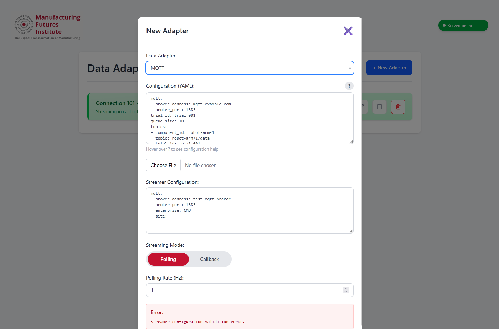
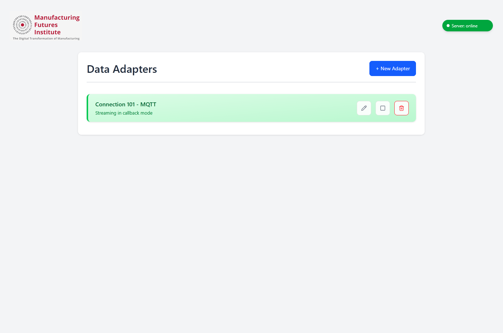
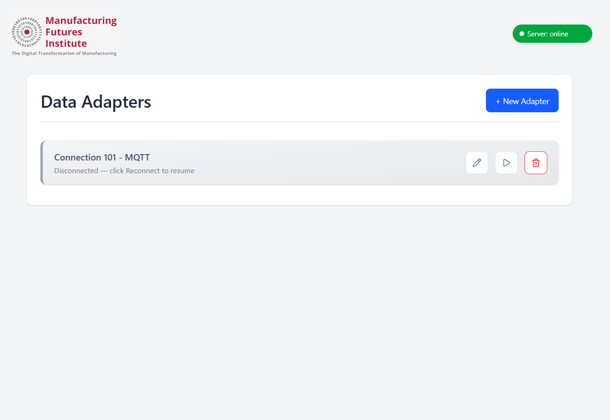

# Data Adapter Application

The application gives a REST API interface (`backend`) to the mfi-ddb library for data adapter connections. It also provides a ReactJS (Vite) based frontend (`frontend`) to interact with the backend API and display the data adapter connections.


> [!Note]
> Details of both the backend and frontend are provided in respective README.md files. \
> Backend: [backend/README.md](backend/README.md) \
> Frontend: [frontend/README.md](frontend/README.md)

<p align="center">
  
  
  
</p>

## Docker Setup

The application can be run using Docker for a consistent and isolated environment.

**Quick Start:**
```
docker compose up --build -d
```

Open the browser and navigate to `http://localhost:3000` to access the application. The backend API is available directly at `http://localhost:8000`.

The backend's connection state (which adapters are configured, their config, and whether they're streaming/paused/stopped) is persisted to a SQLite file on the `backend_data` Docker volume, so it survives `docker compose restart`/rebuilds - only removing the volume (`docker compose down -v`) clears it.

### Customization

* **To use a different host port for the frontend**, edit the `ports` entry under the `frontend` service in `compose.yaml`:
    - Replace `"3000:80"` with `"<your-port>:80"`. Only the host-side port (before the colon) should change - `80` is where nginx listens inside the container and must stay as-is.

* **To use a different host port for the backend**, edit the `ports` entry under the `backend` service:
    - Replace `"8000:8000"` with `"<your-port>:8000"`. Again, only the host-side port should change.

* **To access the application from a different machine on your network**, no configuration changes are needed beyond the port mappings above. The frontend container's nginx proxies all `/api/` requests to the backend over Docker's internal network (not the host), so the browser only ever needs to reach the frontend's exposed port - navigate to `http://<host-ip>:<frontend-port>` from the other machine.
