# MFI DDB Library

Library to stream data to Digital Data Backend (DDB) for the MFI project. It can be installed using pip. [https://pypi.org/project/mfi-ddb/](https://pypi.org/project/mfi-ddb/) 

```
pip install mfi_ddb
```

## Installation - By Source

### using uv manager

Pre-requisite: Install [uv manager](https://docs.astral.sh/uv/getting-started/installation/)

```
git clone --recurse-submodules https://github.com/cmu-mfi/mfi_ddb_library.git
cd mfi_ddb_library/mfi_ddb_package
uv sync
```

### using pip/venv

**Linux**
```
git clone --recurse-submodules https://github.com/cmu-mfi/mfi_ddb_library.git
cd mfi_ddb_library/mfi_ddb_package
python -m venv .venv
source .venv/bin/activate
pip install .
```

**Windows CMD**
```
git clone --recurse-submodules https://github.com/cmu-mfi/mfi_ddb_library.git
cd mfi_ddb_library/mfi_ddb_package
python -m venv .venv
.venv\Scripts\activate.bat
pip install .
```

## Concept

```mermaid
flowchart LR;
    A[Data Source] --> B[Data Adapter];
    D[Streamer] --> M[MQTT Client];
    B --> D;
    C[Topic Family] --> D;
    M-->X[MQTT Broker];    

    classDef highlight fill:#094d57
    class B,C,D highlight
```



MFI DDB Library gives tools to write
* "MQTT Client" which streams data from a "Data Source" to a "MQTT broker". The data source may not be generating MQTT messages directly as per [MFI-DDB schema](./src/mfi_ddb/topic_families/schema/README.md). The library provides a way to convert the data to MQTT messages and stream them to the broker.

To be able to do the above three major classes are provided:

* **Data Adapter**: These are the objects that represent the data that needs to be streamed. These objects are responsible for converting the data to mfi_ddb ingestible structure.
* **Streamer**: This is responsible for publishing MQTT messages to the broker. It uses the data from data adapters to stream the data. Streaming can be event driven using obeserver callback or polling based.
* **Topic Family**: These classes allow streamer to convert data from adapters to MQTT payload as required by respective topic branch (`historian`, `blob`, `kv`)

## Usage

* Review the [examples](examples) for usage.

* **[WIP]** [mqtt_client_tutorial.ipynb](examples/mqtt_client_tutorial.ipynb) gives a step by step tutorial to write your own MQTT client for mfi_ddb franework.

## Available Classes

### Data Adapters

* [ROS](src/mfi_ddb/data_adapters/mtconnect.py)
* [ROS Files](src/mfi_ddb/data_adapters/ros_files.py)
* [Local Files](src/mfi_ddb/data_adapters/local_files.py)
* [MQTT](src/mfi_ddb/data_adapters/mqtt.py)
* [MTConnect](src/mfi_ddb/data_adapters/mtconnect.py)
* [gRPC](src/mfi_ddb/data_adapters/grpc.py)
* [key_value](src/mfi_ddb/data_adapters/key_value.py)
* [ROS2](src/mfi_ddb/data_adapters/ros2.py)

To create a new data adapter, please follow the [checklist](./src/mfi_ddb/data_adapters/README.md#new-data-adapter-checklist) and refer to the existing data adapters for implementation reference.

Use the right [PR template](./.github/PULL_REQUEST_TEMPLATE/data_adapters.md) by following instructions [here](./.github/PULL_REQUEST_TEMPLATE/README.md).

### Streamer

* [Streamer](mfi_ddb/streamer/streamer.py)

### Topic Family

* [BaseTopicFamily](mfi_ddb/topic_families/base.py)
* [BlobTopicFamily](mfi_ddb/topic_families/blob.py)
* [KeyValueTopicFamily](mfi_ddb/topic_families/key_value.py)
* [SpbTopicFamily](mfi_ddb/topic_families/time_series_spb.py)

## Streaming Metadata

When streaming data to the broker, the following metadata is recorded through the `mfi-ddb` stream:

| Metadata | Description | Recorded as |
|-------|-------------|-------------|
| location context | The location context of the data being streamed, which includes the enterprise, site, area, and device. | [topic structure](./schema/README.md) |
| attributes | Key-value pairs that provide additional information about the data being streamed. These are defined in the adapter yaml configuration file. | streamed on the same topic before data using the same topic family encoding |
| streaming configuration | The configuration of the data stream, which includes broker information, enterprise and site details. | streamed on the `kv` and `blob` at birth and death of data streaming  |
| adapter configuration | The configuration of the adapter that is streaming the data, which includes all the components and their attributes | streamed on the `kv` and `blob` at birth and death of data streaming |  

## Executable Modules

### [stream_data.py](mfi_ddb/scripts/stream_data.py)

#### Example usage

Use a configuration directory:
```
$ python -m mfi_ddb.scripts.stream_data --data_adapter 'MQTT' --config_dir ./configs
```

Use specific configuration files:
```
$ python -m mfi_ddb.scripts.stream_data -d 'Local Files' --adapter_cfg ./configs/local_files.yaml --streamer_cfg ./configs/streamer.yaml
```

Enable polling mode with a specific rate (in Hz):
```
$ python -m mfi_ddb.scripts.stream_data -d 'MTConnect' -a ./configs/mtconnect.yaml -s ./configs/streamer.yaml -p True -r 2
```

#### Command-line arguments
```
usage: stream_data.py [-h] --data_adapter DATA_ADAPTER [--config_dir CONFIG_DIR]
                      [--adapter_cfg ADAPTER_CFG] [--streamer_cfg STREAMER_CFG] [--polling POLLING]
                      [--poll_rate POLL_RATE]

Stream data using MFI-DDB library.

optional arguments:
  -h, --help            show this help message and exit
  --data_adapter DATA_ADAPTER, -d DATA_ADAPTER
                        Type of data adapter to use. Supported: 'Local Files', 'MTConnect', 'MQTT',
                        'ROS', 'ROS Files'
  --config_dir CONFIG_DIR, -cd CONFIG_DIR
                        Directory containing the configuration files (local_files.yaml and mqtt.yaml).
                        If --streamer_cfg or --adapter_cfg are provided, this argument is ignored.
  --adapter_cfg ADAPTER_CFG, -a ADAPTER_CFG
                        Path to the local files adapter configuration file (local_files.yaml).
  --streamer_cfg STREAMER_CFG, -s STREAMER_CFG
                        Path to the Streamer configuration file (streamer.yaml).
  --polling POLLING, -p POLLING
                        Enable polling mode. Default is False.
  --poll_rate POLL_RATE, -r POLL_RATE
                        Polling rate in Hz. Default is 1 Hz, if --polling is set to True.
```

## Development

### Pre-commit hooks

Hooks run linting, formatting, and hygiene checks before each commit. They are scoped to `mfi_ddb_package/` and live in [`mfi_ddb_package/.pre-commit-config.yaml`](.pre-commit-config.yaml).

1. Install `pre-commit` once (any Python environment on your machine):
   ```
   uv tool install pre-commit     # or: pipx install pre-commit
   ```
2. Install dependencies (provides `ruff`):
   ```
   uv sync --dev
   ```
3. Install the hook (run from the **repository root**, i.e. `ddb-workflows/`):
   ```
   pre-commit install --config mfi_ddb_package/.pre-commit-config.yaml
   ```

The ruff hooks auto-fix and reformat files in place and re-stage the changes. The first run after enabling hooks may rewrite a number of files (import sorting, etc.); to keep history clean, you can apply the bulk reformat manually once and commit it separately before relying on the hook:

```
uv run ruff check --fix . && uv run ruff format .
```

To run all hooks manually against the whole repo:
```
pre-commit run --config mfi_ddb_package/.pre-commit-config.yaml --all-files
```

## License

This project is licensed under the BSD-3-Clause License - see the [LICENSE](LICENSE) file for details.
