# MFI DDB Schema V1.0

MFI DDB Schema V1.0 is a schema for the data that is streamed to the Digital Data Backbone (DDB) for the MFI project. The schema is designed to be flexible and extensible to accommodate different types of data.\

The messages are sent and received using a pub-sub MQTT broker. The schema specifies which topics to use for different types of data. The schema also specifies the structure of the payload for each type of data.

## Topic Structure

* **spbv1.0** [time series data]: Sparkplug B
* **k-v** [non-time series data]: Key-Value
* **blob** [files]: Binary Large Object

```mermaid
flowchart LR;
    A[mfi_ddb]-->B[v1.0];
    B --> C[spbv1.0] --> F["enterprise"];
    B --> D[k-v] --> F;
    B --> E[blob] --> F;
    F --> G["site"];
    G --> H["area"];
    H --> I["device"];
    F --> I;
    G --> I;    
    I --> X["..."];
    F --> X;
    G --> X;
    H --> X;


    classDef highlight fill:#094d57
    class A,B,C,D,E highlight
```

`enterprise`, `site`, `area`, and `device` are optional placeholders for the actual values of the enterprise, site, area, and device.

Examples: 
* `mfi_ddb/v1.0/k-v/CMU/Mill19/Mezzanine-Lab/yk-destroyer/#`
* `mfi_ddb/v1.0/spbv1.0/CMU/Mill19/HAAS-UMC750/#`

## Payload Schema

### spbv1.0 [time-series]

Since we are using Aveva PI for our time series data, the Sparkplug B schema for our time series data is inspired from them. The general schema for Sparkplug B v1.0 is defined in the [Sparkplug specification](https://sparkplug.eclipse.org/specification/version/3.0/documents/sparkplug-specification-3.0.0.pdf).

Key points to note:

* Sparkplug requires following topic structure: `namespace/group_id/message_type/node_id/[device_id]`
* Sparkplug messages are serialized using Google Protocol Buffers ([protobuf](https://protobuf.dev/)).
* In reference to the above structure, 
    * `namespace` = `mfi_ddb/v1.0/spbv1.0`
    * `group_id` = `enterprise`
    * `message_type` = Sparkplug B message type, like DDATA, DBIRTH, etc.
    * `node_id` = `site`
    * `device_id` = `area` (optional)
* mfi_ddb expects atleast DBIRTH, DDATA messages. DDEATH is optional.
* Metric naming convention is defined in [spbv-metric-naming.md](./spbv-metric-naming.md)
* `mfi_ddb` library uses [mqtt-spb-wrapper](https://pypi.org/project/mqtt-spb-wrapper/) to create sparkplug messages.
* The messages while not directly human-readable, can be decoded using the [protobuf schema](./spbv.proto). Some MQTT brokers, [like EMQX](https://www.emqx.com/en/blog/mqtt-sparkplug-in-action-a-step-by-step-tutorial), have built in capability to do so.

### blob [binary data]

blob topic tree expects large binary files. 

* The file data is sent as a binary payload of a json message.
* The json message is serialized using [protobuf](https://protobuf.dev/) protocol.
* The schema is defined in [blob.proto](./blob.proto).
* The messages while not directly human-readable, can be decoded using the above protobuf schema. Some MQTT brokers, [like EMQX](https://www.emqx.com/en/blog/mqtt-sparkplug-in-action-a-step-by-step-tutorial), have built in capability to do so.

### k-v [non-time-series]

* The messages in k-v topic tree can be used to send non-time series data. 
* The schema is designed to be flexible and extensible to accommodate different types of data. 
* The schema is defined in [k-v.json](./k-v.json).
* While [blob](#blob-binary-data) and [spbv1.0](#spbv1.0-time-series) are protobuf serialized, k-v messages are sent as json for ease of readability.