# MFI DDB Schema V1.0

MFI DDB Schema V1.0 is a schema for the data that is streamed to the Digital Data Backbone (DDB) for the MFI project. The schema is designed to be flexible and extensible to accommodate different types of data.\

The messages are published to an MQTT broker, which uses the publish-subscribe model to route them to the appropriate subscribers. The schema defines the topics used for different types of data and specifies the structure of the payload for each data type.

## Topic Structure

* **historian** [time series data]: Sparkplug B
* **kv** [non-time series data]: Key-Value
* **blob** [files]: Binary Large Object

```mermaid
flowchart LR;
    B[mfi-v1.0];
    B --> C[historian] --> F["enterprise"];
    B --> D[kv] --> F;
    B --> E[blob] --> F;
    F --> G["site*"];
    G --> H["area*"];
    H --> I["device*"];
    I --> X["..."];
    F --> X;
    G --> X;
    H --> X;


    classDef highlight fill:#094d57
    class A,B,C,D,E highlight
```

> \*  `site`, `area`, and `device` are optional placeholders for the actual values of the enterprise, site, area, and device.

Examples: 
* `mfi-v1.0-kv/CMU/Mill19/Mezzanine-Lab/yk-destroyer/#`
* `mfi-v1.0-historian/CMU/Mill19/HAAS-UMC750/#`

## Payload Schema

### historian [time-series]

Since we are using Aveva PI to store our time series data, we have adopted the Sparkplug B schema as an initial model for inspiration. It's flexibility allows it to be applied to other data types. The general schema for Sparkplug B v1.0 is defined in the [Sparkplug specification](https://sparkplug.eclipse.org/specification/version/3.0/documents/sparkplug-specification-3.0.0.pdf).

Key points to note:

* Sparkplug requires following topic structure: `namespace/group_id/message_type/node_id/[device_id]`
* Sparkplug messages are serialized using Google Protocol Buffers ([protobuf](https://protobuf.dev/)).
* In reference to the above structure, 
    * `namespace` = `mfi-v1.0-historian`
    * `group_id` = `enterprise`
    * `message_type` = Sparkplug B message type, like DDATA, DBIRTH, etc.
    * `node_id` = `site`
    * `device_id` = `area` (optional)
* mfi_ddb expects at least a DBIRTH message to establish identity and a DDATA message to send data.
* Metric naming convention is defined in [historian-metric-naming.md](./historian-metric-naming.md)
* `mfi_ddb` library uses [mqtt-spb-wrapper](https://pypi.org/project/mqtt-spb-wrapper/) to create sparkplug messages.
* The messages while not directly human-readable, can be decoded using the [protobuf schema](./spbv.proto). Some MQTT brokers, [like EMQX](https://www.emqx.com/en/blog/mqtt-sparkplug-in-action-a-step-by-step-tutorial), have built in capability to do so.

### blob [binary data]

blob topic tree expects large binary files. 

* The file data is sent as a binary payload of a json message.
* The json message is serialized using [protobuf](https://protobuf.dev/) protocol.
* The schema is defined in [blob.proto](./blob.proto).
* The messages while not directly human-readable, can be decoded using the above protobuf schema. Some MQTT brokers, [like EMQX](https://www.emqx.com/en/blog/mqtt-sparkplug-in-action-a-step-by-step-tutorial), have built in capability to do so.

### kv [non-time-series]

* The messages in k-v topic tree can be used to send non-time series data. 
* The schema is designed to be flexible and extensible to accommodate different types of data. 
* The schema is defined in [kv.json](./kv.json).
* While [blob](#blob-binary-data) and [historian](#historian-time-series) are protobuf serialized, k-v messages are sent as json for ease of readability.

## Streaming Metadata

When streaming data to the broker, the following metadata is recorded through the `mfi-ddb` stream:

| Metadata | Description | Recorded as |
|-------|-------------|-------------|
| location context | The location context of the data being streamed, which includes the enterprise, site, area, and device. | [topic structure](#topic-structure) |
| attributes | Key-value pairs that provide additional information about the data being streamed. These are defined in the adapter yaml configuration file. | streamed on the same topic before data using the same topic family encoding |
| streaming configuration | The configuration of the data stream, which includes broker information, enterprise and site details. | streamed on the `kv` and `blob` at birth and death of data streaming  |
| adapter configuration | The configuration of the adapter that is streaming the data, which includes all the components and their attributes | streamed on the `kv` and `blob` at birth and death of data streaming |  
