# Data Adapters

```mermaid
flowchart LR;
    A[Data Source] --> B[Data Adapter];
    D[Streamer] --> M[MQTT Client];
    B --> D;
    C[Topic Family] --> D;
    M-->X[MQTT Broker];    

    classDef highlight fill:#094d57
    class B highlight
```

Data Adapters are the objects that represent the data that needs to be streamed. These objects are responsible for converting the data to mfi_ddb ingestible structure.

[\[More Info\]](../../../README.md#concept)

## Available Data Adapters

* [ROS](src/mfi_ddb/data_adapters/mtconnect.py)
* [ROS Files](src/mfi_ddb/data_adapters/ros_files.py)
* [Local Files](src/mfi_ddb/data_adapters/local_files.py)
* [MQTT](src/mfi_ddb/data_adapters/mqtt.py)
* [MTConnect](src/mfi_ddb/data_adapters/mtconnect.py)
* [gRPC](src/mfi_ddb/data_adapters/grpc.py)

## New Data Adapter Checklist

When writing a new data adapter, please make sure to follow the checklist below:

- [ ] Inherit from `mfi_ddb.data_adapters.base.BaseDataAdapter`

- [ ] Implement the required method: `get_data()`. This populates `self._data` with the latest data from the data source.
  - [ ] Implement `update_data()` method if first fetch and subsequent fetches require different logic.

- [ ] Update `SCHEMA` class to include the new data adapter and its configuration parameters.

- [ ] Update `NAME`, `CONFIG_HELP`, `CONFIG_EXAMPLE`, `RECOMMENDED_TOPIC_FAMILY`, `SELF_UPDATE` class variables.

- [ ] Constructor checklist:
    - [ ] Use only one dict parameter `config` to initialize the data adapter.
    - [ ] Call `super().__init__(config)` to initialize the base class.
    - [ ] Populate `self.component_ids` with the component ids that this data adapter will be streaming data for.
    - [ ] Initialize `self.attributes` with metadata about the data being streamed. 
    - [ ] Initialize `self._data` with component ids as keys.

- [ ] Write unit tests for the new data adapter and add them to [`tests/data_adapters`](../tests/data_adapters)

