# MFI-DDB Database Nodes

[MFI-DDB architecture](https://cmu-mfi.github.io/ddb/pages/architecture.html) allows for the integration of various database nodes to facilitate data storage and retrieval. This directory has all compatible database nodes.

- [Overview](#overview)
- [Compatible Database Nodes](#compatible-database-nodes)
- [Node specifications](#node-specifications)
    - [Web Service Endpoints](#web-service-endpoints)
    - [Connector Configuration](#connector-configuration)

## Overview
Here is an overview of a database node within the MFI-DDB framework.

* Each database node consists of three main components:
  * **Connector**: Interfaces with the MFI-DDB broker to subscribe to data streams.
  * **Database**: The actual database system (e.g., SQL, NoSQL) that stores the data.
  * **Web Service**: Exposes APIs for data retrieval.

_Arrow direction in the diagram below shows the data flow in the framework._

```mermaid
flowchart BT
    subgraph ModuleX["Database Node 1"]
        direction BT
        B1[Connector]
        C1[Database]
        D1[Web Service]
        B1 --> C1
        C1 --> D1
    end

    subgraph ModuleY["Database Node ..."]
        direction BT
        B2[Connector]
        C2[Database]
        D2[Web Service]
        B2 --> C2
        C2 --> D2
    end

    subgraph ModuleZ["Database Node n"]
        direction BT
        B3[Connector]
        C3[Database]
        D3[Web Service]
        B3 --> C3
        C3 --> D3
    end    

    A[Broker] --> B1
    A --> B2
    A --> B3
    D1 --> E[Retrieval API]
    D2 --> E
    D3 --> E

    classDef highlight fill:#094d57
    class C1,C2,C3 highlight
    
```

## Compatible Database Nodes
The following database nodes are currently compatible with the MFI-DDB framework. More details about the compatible payloads can be found in the [MFI DDB Schema V1.0](../../../schema/README.md).

| Database Node  | Database Type | Compatible Payloads |
|--------------------------------|---------------|----------|
| [blob-cfs](./blob-cfs/)        | File Storage  | blob     |
| [kv-pg](./kv-pg/)              | SQL           | kv       |
| [historian-pi](./historian-pi/)| [Aveva PI](https://www.aveva.com/en/products/aveva-pi-system/)| historian |

## Node specifications
Each database node has specific requirements and specifications for its components. Below are the general specifications for each component.

### Web Service Endpoints
Each database node exposes a web service with endpoints for data retrieval. The endpoints are as follows:

TODO

### Connector Configuration
Each database node requires specific configuration settings for the connector to interface with the MFI-DDB broker. The configuration parameters are as follows:

TODO
