# MFI-DDB Retrieval API

Retrieval API is a web service that provides an interface for users to query and retrieve data stored in the database nodes of the MFI-DDB framework. It acts as a bridge between the database nodes and the end-users, allowing them to access the data through a standardized API.

- [Overview](#overview)
- [Components](#components)
    - [Metadata Store (MDS)](#metadata-store-mds)
    - [Retrieval Web Service (RWS)](#retrieval-web-service-rws)

## Overview

The API interfaces with the database nodes using their exposed web services to fetch the requested data. The user queries are processed using the metadata stored in the Metadata Store to identify the relevant database nodes and data entries.

_Arrow direction in the diagram below shows the data flow in the framework. It doesn't represent the direction of requests._

```mermaid
flowchart BT
    subgraph ModuleX["Database Nodes"]
        direction TB
        D1[Database Node 1]
        D2[Database Node ...]
        D3[Database Node n]       
    end

    subgraph ModuleY["Retrieval API"]
        direction LR
        E["MDS (MetaData Store)"] --> F["RWS (Retrieval Web Service)"]
    end

    A[Broker] --> E    
    A --> ModuleX
    D1 --> F
    D2 --> F
    D3 --> F
    F --> User

    classDef highlight fill:#094d57
    class ModuleY highlight;    
```

> [!Note]
> For more details on the database nodes, please refer to the [Databases](../databases/README.md) documentation.

## Components

Two major components of the Retrieval API module are:
* Retrieval Web Service (RWS)
* Metadata Store (MDS)

### Retrieval Web Service (RWS)

The RWS is implemented as a RESTful web service that handles incoming requests from users, processes them using the metadata, and retrieves the relevant data from the database nodes. It provides endpoints for querying the data based on various parameters and returns the results in a structured format (e.g., JSON).

_\<insert table with endpoints and their descriptions\>_

### Metadata Store (MDS)

The MDS stores metadata from the incoming data streams, that helps filter, search, and retrieve the relevant data from the database nodes. It maintains information about the data entries, their locations, and other relevant attributes that facilitate efficient querying and retrieval of data. We use PostgreSQL as the database for MDS.

_\<insert table schemas and their descriptions\>_
