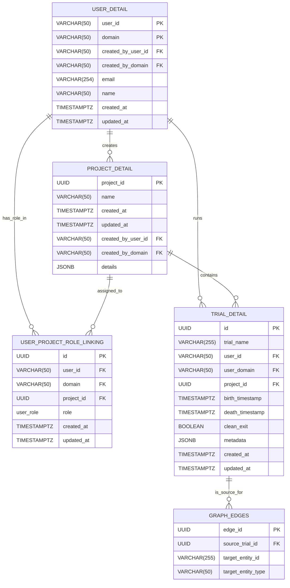

# Metadata Store - PostgreSQL



We use psycopg2 in our python code to interact with PostgreSQL. [Tutorial reference](https://neon.com/postgresql/postgresql-python/create-tables)

## Setup and Installation

Before connectors and DWS service can be used, the postgresql database must be set up and configured. The following steps outline the process:

1. **Install PostgreSQL**
    - Follow installations step for your server OS: https://www.enterprisedb.com/docs/supported-open-source/postgresql/overview/
    - Set superuser password during installation and update `database.ini` with the credentials.
    - Use default port 5432 for PostgreSQL unless there is a conflict with another service.
    - For Windows users: Please follow [command line tools](https://www.enterprisedb.com/docs/supported-open-source/postgresql/installing/windows/#command-line-tools) installation steps to ensure `psql` is added to your system PATH for easier access.

2. **Create `mds` Database**

    - First, connect to the PostgreSQL server using the psql client tool. \
    `psql -U postgres`
    - Second, create a new database called suppliers. \
    `CREATE DATABASE mds;`
    - Third, exit the psql.\
    `exit`

```shell
$ psql -U postgres
Password for user postgres:

psql (18.3)
Type "help" for help.

postgres=# CREATE DATABASE mds;
CREATE DATABASE
postgres=# exit
```    

3. Check installation and database 
    - Prerequisite: [uv manager](https://docs.astral.sh/uv/getting-started/installation/)
    - Run `connect.py` to check if psql and the database are properly set up
```shell
$ uv run connect.py
Connected to the PostgreSQL server.
```

4. Create and check tables

```shell
$ uv run create_tables.py
$ uv run check_tables.py
All tables exist in the database.
```