# Data Adapters UI

React-based interface for managing industrial IoT data adapter connections with real-time monitoring.

## 📁 Project Structure

```
ui_interfaces/data_adapters/
├── src/
│   ├── App.jsx                  # Main application
│   ├── App.css                  # Global styles
│   ├── api.js                   # API client
│   └── components/
│       ├── ConnectionList.jsx   # Display all connections
│       ├── ConnectionItem.jsx   # Individual connection
│       ├── ConnectionModal.jsx  # Create/edit form
│       ├── ConnectionManager.js # State management
│       └── Modal.jsx           # Reusable modal
├── public/                      # Static files
├── package.json                 # Dependencies
└── README.md                   # This file
```

## 🚀 Quick Start

### Prerequisites
- Node.js 14+ and npm
- Backend API running on port 8000

### Installation & Run
```bash
cd ui_interfaces/data_adapters
npm install
npm start
```

Application opens at `http://localhost:3000`

### Alternative: Desktop App
```bash
npm run electron
```

## 🔧 Component Flow

```mermaid
flowchart TD
    A[App.jsx] --> B[ConnectionList.jsx]
    A --> C[ConnectionModal.jsx]
    B --> D[ConnectionItem.jsx × N]
    A --> E[ConnectionManager.js]
    
    A --> F{Server Status}
    F -->|Online| G[Auto Restore Connections]
    F -->|Offline| H[Show Offline State]
    
    B --> I[Add New Connection]
    I --> C
    
    D --> J[Resume/Pause/Edit/Delete]
    J --> K[API Calls via api.js]
    
    C --> L[YAML Validation]
    C --> M[Save to localStorage]
    M --> E
    
    style A fill:#2d5aa0
    style B fill:#0f7b0f  
    style C fill:#094d57
```



## 📚 Components Overview

### App.jsx - Main Controller
- Monitors server health (5-second intervals)
- Manages global state (connections, modals, restoration)
- Handles automatic connection restoration on server restart

### ConnectionList.jsx - Connection Display
- Shows all connections with status indicators
- Provides "Add New" and "Restore All" buttons
- Passes actions to individual ConnectionItems

### ConnectionItem.jsx - Individual Connection
- Displays connection status (🟢 Active, 🟡 Paused, 🔴 Error)
- Handles Resume, Pause, Edit, Delete actions
- Shows real-time status updates

### ConnectionModal.jsx - Configuration Form
- Multi-step wizard for creating/editing connections
- YAML validation against backend schemas
- Supports all adapter types (MTConnect, MQTT, ROS, Files)

### ConnectionManager.js - State Persistence
- Saves connections to localStorage
- Manages connection states (streaming/paused)
- Handles restoration logic

### api.js - Backend Communication
- HTTP client for DDB API endpoints
- Handles form data and file uploads
- Error handling and response parsing

## 🔧 Configuration Examples

### MTConnect Adapter
```yaml
mtconnect:
  agent_ip: "192.168.1.1"
  agent_url: "http://192.168.1.1:5000"
  device_name: "MTConnectDevice"
  trial_id: "trial_001"
```

### MQTT Data Adapter
```yaml
mqtt:
  broker_address: "broker.emqx.io"
  broker_port: 1883
  topics: ["sensor/temperature", "sensor/humidity"]
  username: "your_username"
  password: "your_password"
  tls_enabled: false
  debug: true
```

### ROS Data Adapter
```yaml
ros:
  trial_id: "trial_001"
  set_ros_callback: true
  devices:
    device1:
      namespace: "robot_arm"
      rostopics: ["/joint_states", "/camera/image_raw"]
      attributes:
        manufacturer: "RobotCorp"
        model: "RobotArmX"
        description: "A robotic arm for testing purposes."
```

### ROS Files Adapter
```yaml
ros_files:
  trial_id: "trial_001"
  set_ros_callback: true
  devices:
    device1:
      namespace: "robot_arm"
      rostopics: ["/joint_states", "/camera/image_raw"]
      attributes:
        manufacturer: "RobotCorp"
        model: "RobotArmX"
```

### Local Files Adapter
```yaml
local_files:
  watch_dir: ["/path/to/watch/dir"]
  buffer_size: 10
  wait_before_read: 5
  system:
    name: "local_files_system"
    trial_id: "trial_001"
    description: "Local files data adapter system"
    manufacturer: "Example Corp"
    model: "LocalFilesModel"
```

### Complete Configuration with MQTT Streaming
```yaml
# Any adapter configuration above, plus:
mqtt:
  broker_address: broker.emqx.io
  broker_port: 1883
  enterprise: test-enterprise
  site: test-site
  username: 
  password: 
  tls_enabled: false
  debug: true

topic_family: "historian"  # or "kv" or "blob"
```

## 🔄 Connection States

| State | Icon | Description |
|-------|------|-------------|
| Streaming | 🟢 | Active data flow |
| Paused | 🟡 | Stopped by user |
| Error | 🔴 | Connection failed |
| Offline | ⚫ | Not connected |

## 🛠️ Development

### File Structure
- **App.jsx**: Entry point, global state
- **ConnectionList**: Main UI, connection grid
- **ConnectionItem**: Individual connection card
- **ConnectionModal**: Configuration forms
- **ConnectionManager**: localStorage interface
- **api.js**: Backend API client

### Key Features
- **Auto-restore**: Connections restored on server restart
- **Real-time status**: Live connection monitoring  
- **State persistence**: Configurations saved locally
- **YAML validation**: Real-time config validation

### Testing
```bash
npm test                    # Run tests
npm test -- --coverage     # With coverage
npm test -- --watch        # Watch mode
```

### Build
```bash
npm run build              # Production build
npm run electron           # Desktop app
```

## 🎯 How It Works

1. **Start App**: Loads saved connections from localStorage
2. **Server Check**: Monitors backend API health
3. **Auto Restore**: Restores streaming connections when server comes online
4. **Real-time Updates**: Polls connection status every few seconds
5. **User Actions**: Create, edit, pause, resume, delete connections
6. **State Sync**: All changes saved to localStorage

## 📞 Getting Help

- Check backend API is running on port 8000
- Open browser console (F12) for debug logs
- Use `window.debugRestore()` for manual restoration
- Clear localStorage if state gets corrupted