# Data Adapters UI

React-based interface for managing mfi-ddb data adapter connections with real-time monitoring.

## 📁 Project Structure

```
ui_interfaces/data_adapters/
├── src/
│   ├── App.jsx                  # Main application
│   ├── App.css                  # Global styles
│   ├── api.js                   # API client functions
│   ├── components/
│   │   ├── ConnectionList.jsx   # Display all connections
│   │   ├── ConnectionItem.jsx   # Individual connection
│   │   ├── ConnectionModal.jsx  # Create/edit form
│   │   ├── ConnectionManager.js # State management
│   │   └── Modal.jsx            # Reusable modal
│   ├── data/
│   │   └── defaults.js          # Default configurations and constants
│   ├── images/
│   │   └── logo_mfi.png         # Logo image
│   └── static/                  # Static assets and data members
│       └── conn_ctr.js          # Keeping connection counter
│
├── public/                      # Static files
├── package.json                 # Dependencies
└── README.md                   # This file
```

## Installation & Run
```bash
npm install
npm start
```
Application opens at `http://localhost:3000`
If a specific port is required, set `PORT` environment variable.

```
PORT=3001 npm start
```

Run as desktop app:
```bash
npm run electron
```

## 🔧 Component Flow

> [!WARNING]  
> Review needed.

```mermaid
flowchart TD
    A[App.jsx] --> B[ConnectionList.jsx]
    A --> C[ConnectionModal.jsx]
    B --> D[ConnectionItem.jsx × N]
    A --> E[ConnectionManager.js]
    
    A --> F{Server Status}
    F -->|Online| G[Auto Restore Connections]
    F -->|Offline| H[Show Offline State]
    
    B --> I[Add New Connection]
    I --> C
    
    D --> J[Resume/Pause/Edit/Delete]
    J --> K[API Calls via api.js]
    
    C --> L[YAML Validation]
    C --> M[Save to localStorage]
    M --> E
    
    style A fill:#2d5aa0
    style B fill:#0f7b0f  
    style C fill:#094d57
```



### 📚 Components Overview

### App.jsx - Main Controller
- Monitors server health (5-second intervals)
- Manages global state (connections, modals, restoration)
- Handles automatic connection restoration on server restart

### ConnectionList.jsx - Connection Display
- Shows all connections with status indicators
- Provides "Add New" and "Restore All" buttons
- Passes actions to individual ConnectionItems

### ConnectionItem.jsx - Individual Connection
- Displays connection status (🟢 Active, 🟡 Paused, 🔴 Error)
- Handles Resume, Pause, Edit, Delete actions
- Shows real-time status updates

### ConnectionModal.jsx - Configuration Form
- Multi-step wizard for creating/editing connections
- YAML validation against backend schemas
- Supports all adapter types (MTConnect, MQTT, ROS, Files)

### ConnectionManager.js - State Persistence
- Saves connections to localStorage
- Manages connection states (streaming/paused)
- Handles restoration logic

### api.js - Backend Communication
- HTTP client for DDB API endpoints
- Handles form data and file uploads
- Error handling and response parsing